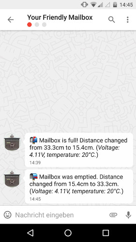

# smartmail

[![CircleCI][circle-ci-badge]][circle-ci]

This is a "smart mailbox" based on LoRaWAN and the
[ax-sense](https://twitter.com/adnexo_gmbh/status/901370927405047808) that will
notify you through [Threema](https://threema.ch/) when your physical mailbox
just changed from empty to full, or vice versa.

## Configuration

Export the following environment variables:

- `TTN_APP_ID`: The Things Network App ID
- `TTN_ACCESS_KEY`: The Things Network Access Key
- `THREEMA_FROM`: Your Threema Gateway ID, 8 characters starting with `*`
- `THREEMA_TO`: A comma separated list of recipient Threema IDs
- `THREEMA_SECRET`: The Threema Gateway API secret
- `THREEMA_PRIVATE_KEY`: The hex encoded private key of your Gateway ID

If you want to send data to InfluxDB too, set the following three env vars:

- `INFLUXDB_USER`: The InfluxDB username
- `INFLUXDB_PASS`: The InfluxDB password
- `INFLUXDB_DB`: The InfluxDB database
- `INFLUXDB_URL`: The InfluxDB URL (no trailing slash)

If you don't want to manually export environment variables, you can also write
them into a `.env` file (format: `KEY=value`, one entry per line).

## Building

Type `make` to see possible build targets.

There are options to build a release binary on your local machine, or in a
Debian 8 Docker container.

## Deployment

An example `smartmail.service` file for systemd based Linux distributions is
provided.

<!-- Badges -->
[circle-ci]: https://circleci.com/gh/dbrgn/smartmail/tree/master
[circle-ci-badge]: https://circleci.com/gh/dbrgn/smartmail/tree/master.svg?style=shield
